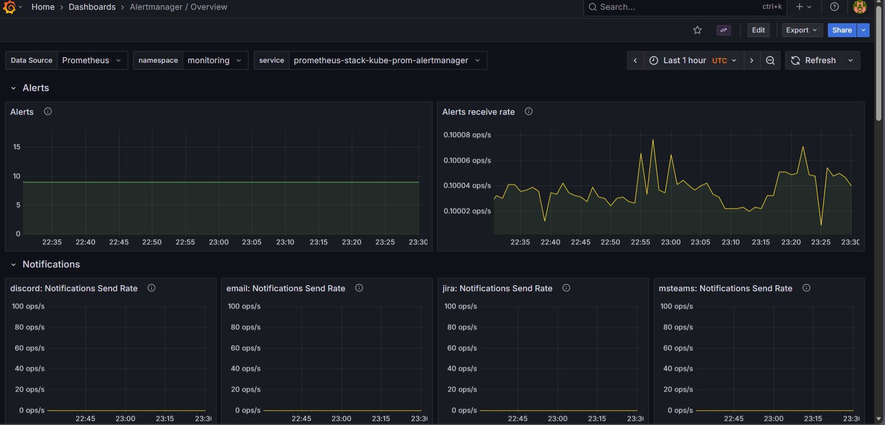
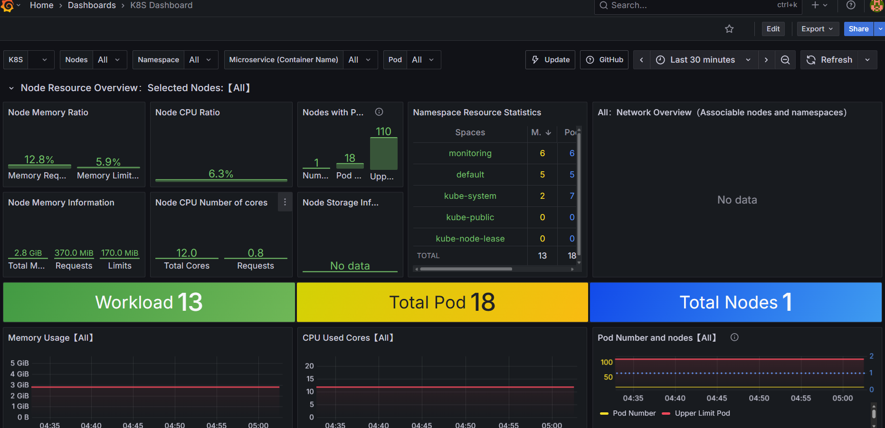

# 🧠 K8s Vote App — Kubernetes Monitoring Setup (Prometheus & Grafana)

This project demonstrates how to deploy and monitor a **Kubernetes-based application** (`k8s-vote-app`) using **Prometheus** and **Grafana** on **Minikube**. It includes setup instructions for Helm-based monitoring stack and integration with your cluster for real-time metrics visualization.

---

## 🏗️ Project Overview

**Stack Components:**
- 🐳 **Docker Desktop** — local Kubernetes environment
- ☸️ **Minikube** — single-node local Kubernetes cluster
- ⚙️ **Helm** — package manager for Kubernetes
- 📊 **Prometheus** — metrics collection & alerting
- 📈 **Grafana** — visualization and dashboarding
- 🧱 **Kubernetes Manifests / Helm charts** — for app & monitoring setup

**Goal:**  
Deploy an app on Minikube and monitor it using Prometheus and Grafana (installed via Helm).

---

## 🚀 Prerequisites

Make sure you have these tools installed:

| Tool | Version (Recommended) | Install Command |
|------|------------------------|----------------|
| Docker Desktop | Latest | [Download here](https://www.docker.com/products/docker-desktop/) |
| Minikube | v1.33+ | `choco install minikube` (Windows) / `brew install minikube` (Mac) |
| Kubectl | v1.29+ | `choco install kubernetes-cli` |
| Helm | v3.14+ | `choco install kubernetes-helm` |
| Git | Any | `choco install git` |

---

## ⚡ Step-by-Step Setup

```bash
# 1️⃣ Start Docker Desktop
# Ensure Docker Desktop is running before starting Minikube.

minikube start --driver=docker

# (verify)
kubectl get nodes


# 2️⃣ Create a Namespace
# We’ll create a dedicated namespace for monitoring tools:

kubectl create namespace monitoring

# (confirm)
kubectl get ns


# 3️⃣ Add the Prometheus Helm Chart Repo

helm repo add prometheus-community https://prometheus-community.github.io/helm-charts
helm repo update


# 4️⃣ Install Prometheus & Grafana Stack

helm install prometheus-stack prometheus-community/kube-prometheus-stack -n monitoring


# 5️⃣ Access Prometheus

kubectl port-forward svc/prometheus-stack-kube-prom-prometheus -n monitoring 9090:9090


# 6️⃣ Access Grafana

kubectl port-forward svc/prometheus-stack-grafana -n monitoring 3000:80


# Default Grafana credentials:
# Username: admin
# Password:
kubectl get secret prometheus-stack-grafana -n monitoring -o jsonpath="{.data.admin-password}" | base64 --decode ; echo

## 🧠 Observability

<p align="center">
  
</p>

<p align="center">
  
</p>


